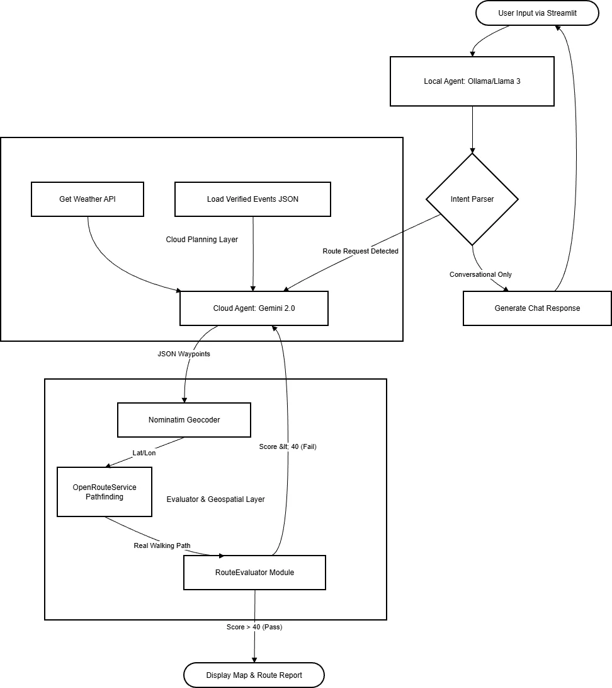

# TG Agents

A hybrid AI framework for community navigation that optimizes routes for event proximity and experiential quality rather than just travel time.


## Overview

TG Agents combines local and cloud-based language models with geospatial APIs to create intelligent walking routes through your community. Unlike traditional navigation apps that focus solely on getting you from A to B as fast as possible, TG Agents discovers local events, considers weather conditions, and generates routes that maximize your experience.

### Key Features

- **Conversational Interface**: Natural language route requests ("Plan a 2-mile walk past any events happening today")
- **Real-time Event Discovery**: Automatically finds and incorporates local events into routes
- **Hybrid AI Architecture**: Local LLM for privacy-preserving intent recognition, cloud LLM for spatial reasoning
- **Route Quality Scoring**: 100-point evaluation system ensures reliable outputs
- **Zero Cost**: Operates entirely within free API tiers

## Architecture



The system consists of three main layers:

**Local Agent Layer**: Ollama/Llama 3 processes user input and determines intent. Route requests are forwarded to the cloud layer, while conversational queries are handled locally.

**Cloud Planning Layer**: Gemini 2.0 receives weather data and pre-geocoded events, then generates JSON waypoints for the requested route.

**Evaluator and Geospatial Layer**: Waypoints are geocoded via Nominatim, converted to real walking paths by OpenRouteService, and scored by the RouteEvaluator. Routes scoring below 40 are flagged for review.

### Module Details

| Module | Technology | Purpose |
|--------|------------|---------|
| Intent Recognition | Ollama + Llama 3 | Parse user requests locally (zero API cost, privacy) |
| Event Retrieval | Gemini 2.0 Flash | Search for real-time local events with grounded search |
| Geocoding | Nominatim (OSM) | Convert addresses to coordinates |
| Route Generation | OpenRouteService | Generate pedestrian-accurate walking paths |
| Route Evaluation | Custom Evaluator | Score routes before display (0-100 points) |

## Tech Stack

| Component | Technology | Daily Limit | Cost |
|-----------|------------|-------------|------|
| UI Framework | Streamlit | Unlimited | Free |
| Map Rendering | Folium | Unlimited | Free |
| Local LLM | Ollama + Llama 3 | Unlimited | Free |
| Cloud LLM | Gemini 2.0 Flash | 1,500 requests, 1M tokens | Free |
| Geocoding | Nominatim | ~8,640 (1/sec) | Free |
| Routing | OpenRouteService | 2,000 requests | Free |
| Weather | Open-Meteo | Unlimited | Free |

**Total Monthly Cost: $0**

## Installation

### Prerequisites

- Python 3.9+
- [Ollama](https://ollama.ai/) with Llama 3 model installed
- Gemini API key (free tier)
- OpenRouteService API key (free tier)

### Setup

1. Clone the repository:
```bash
git clone https://github.com/JustinYe377/TG_Agent.git
cd TG_Agent
```

2. Install dependencies:
```bash
pip install streamlit folium google-generativeai requests
```

3. Install and start Ollama with Llama 3:
```bash
ollama pull llama3:latest
ollama serve
```

4. Run the application:
```bash
streamlit run main.py
```

## Usage

### Basic Route Request

Enter natural language requests in the chat interface:

- "I want to go for a walk"
- "Plan a 2-mile walk for me"
- "Take me to the farmers market and then to a coffee shop"
- "I want to walk somewhere and grab food along the way"

### Configuration

Enter your API keys in the sidebar:

- **Gemini API Key**: Required for event search and route planning
- **OpenRouteService API Key**: Required for pedestrian path generation

### Features

- **Assistant Tab**: Chat interface for route requests
- **Map Tab**: Interactive map with route visualization and event markers
- **Events Tab**: List of discovered local events with geocoding status
- **Evaluator Tab**: Detailed route quality breakdown

## Route Evaluation System

Every route is scored on a 100-point scale before display:

| Metric | Points | Description |
|--------|--------|-------------|
| Event Proximity | 25 | Does the route pass near geocoded events? |
| Route Efficiency | 20 | Balance between direct and scenic (0.25-0.85 ratio) |
| Speed Sanity | 20 | Implied walking speed within 1.5-4.5 mph |
| Geofence Compliance | 15 | All waypoints within target city bounds |
| Completeness | 10 | Required fields present (waypoints, distance, time) |
| Waypoint Quality | 10 | Minimum 5 waypoints, no duplicates or clusters |

### Score Interpretation

- **80-100**: Good quality route
- **60-79**: Acceptable with minor issues
- **40-59**: Poor quality, review warnings
- **0-39**: Significant issues, likely unusable

## Project Structure

```
tg-agents/
├── main.py              # Streamlit UI and application entry point
├── agent_logic.py       # Event fetching, route generation, Ollama/Gemini integration
├── config.py            # Prompts, constants, default coordinates
├── utils.py             # Parsing, geocoding, routing, usage tracking
├── evaluator.py         # Route quality scoring system
├── assets/
│   └── architecture.png # System architecture diagram
└── README.md
```

## Experimental Results

Tested with 15 prompts across three difficulty levels:

| Difficulty | Avg Score | Tag Success | Route Success |
|------------|-----------|-------------|---------------|
| Easy | 78.4 | 100% | 80% |
| Medium | 68.2 | 80% | 60% |
| Hard | 52.1 | 60% | 40% |
| **Overall** | **66.2** | **80%** | **60%** |

## Known Limitations

- **Geocoding**: Nominatim may fail on colloquial location names or venues without street addresses
- **Prompt Sensitivity**: Some phrasings work better than others for triggering route generation
- **Event Coverage**: Event discovery depends on web search results for your area

## Future Work

- Fuzzy geocoding with venue databases (Google Places, Foursquare)
- TSP solver for efficient multi-stop circular routes
- Feedback loop using evaluation scores to fine-tune prompts
- Accessibility routing with elevation data and wheelchair-accessible paths
- Real-time event API integration (Eventbrite, Facebook Events)

## Contributing

Contributions are welcome. Please open an issue first to discuss proposed changes.

## License

MIT License

## Acknowledgments

- [Ollama](https://ollama.ai/) for local LLM inference
- [Google Gemini](https://ai.google.dev/) for cloud AI capabilities
- [OpenStreetMap](https://www.openstreetmap.org/) and Nominatim for geocoding
- [OpenRouteService](https://openrouteservice.org/) for pedestrian routing